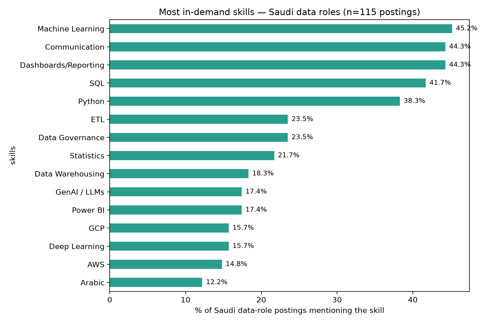
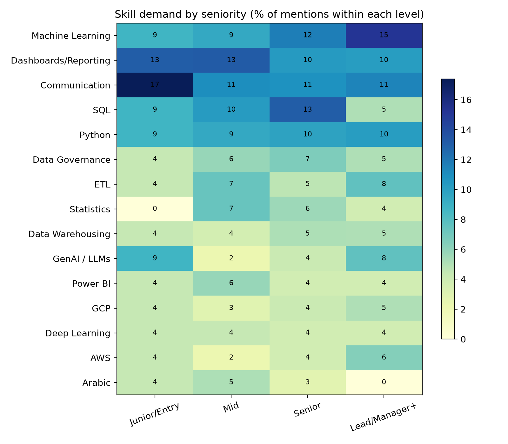

# What Saudi employers want from data professionals

** [Live dashboard](https://saudi-jobs.streamlit.app)** · Data, charts, and the stats below refresh automatically every week

Skills-demand analysis of data roles in Saudi Arabia, built on live postings
collected via the JSearch API (which aggregates Google for Jobs listings from
LinkedIn, Indeed, Bayt, Glassdoor, and company career sites).

## Key findings

<!-- STATS:START -->
**Latest snapshot (Aug 14, 2026): 115 postings** · junior/entry roles: 4% · mention GenAI/LLMs: 17% · require Arabic: 12%
<!-- STATS:END -->

- **Junior/entry roles are scarce** — the Saudi data market is overwhelmingly
  hiring experienced talent
- **SQL and Python dominate**, each appearing in roughly half of all postings
- **GenAI/LLM requirements are already mainstream**, not a niche ask
- **Arabic appears as an explicit requirement** in a meaningful share of
  postings — a signal global analyses miss
- Skill mix shifts with seniority: BI tools dominate analyst roles, while
  cloud and data governance climb with seniority





## How it works

```
collect_jsearch.py  →  extract_skills.py  →  analyze.py / app.py
   (API → raw JSON)     (skills, seniority,     (charts + Streamlit
                         role, dedup, QA)         dashboard)
```

- **Automated ETL**: a GitHub Actions workflow collects fresh postings every
  Friday, reprocesses the dataset, regenerates the charts, updates the stats
  in this README, and commits — the dashboard redeploys on each push
- **Skill extraction** uses a curated regex dictionary (~35 skills) over
  titles and descriptions; seniority is classified from titles, falling back
  to years-of-experience mentions
- **Quality**: aggregator spam is filtered out; a manually validated random
  sample of 15 postings showed seniority correct in 11/13 live postings;
  cross-publisher duplicates are removed by normalized title + company

## Run it yourself

```bash
pip install -r requirements.txt
export RAPIDAPI_KEY="your-key"        # free tier at rapidapi.com → JSearch
python collect_jsearch.py             # collect
python extract_skills.py              # transform
streamlit run app.py                  # explore
```

## Limitations

Skill detection is keyword-based (no semantic matching); "demand" counts any
mention, including nice-to-haves; each snapshot reflects postings live at
collection time, so numbers shift week to week — see the dated stats line
above for the current state. `scrape_bayt.py` is an unused fallback
collector — primary collection is via the API.

---

*Built with Python, pandas, Streamlit, and GitHub Actions.*
